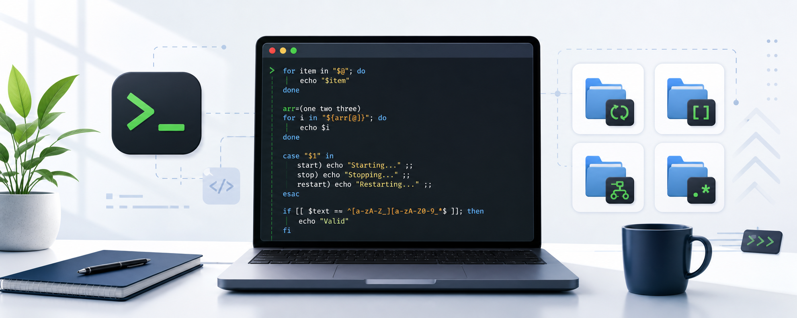

# Bash Scripting Learning Project



This project contains beginner-friendly Bash scripts for learning Linux scripting step by step.  
The files are organized by topic: simple Bash basics, loops, arrays, `case`, and regular expressions.

## Project Goal

The goal of this project is to practice Bash scripting with small examples and worksheet solutions.
Most scripts are written in a simple style so beginners can read, run, and change them easily.

## Folder Overview

| Folder | Description |
| --- | --- |
| `schleifen_beispiele` | Examples for Bash loops: `for`, `while`, `until`, `select`, `break`, and `continue`. |
| `aufgaben_schleifen_loesungen` | Solved loop exercises from the worksheet. |
| `aufgaben_arrays_loesungen` | Solved exercises for Bash arrays and lists. |
| `bash_array_ifelse_beginner` | A simple beginner system-check script using arrays, loops, and `if/else`. |
| `bash_case_beispiele` | Examples for Bash `case` statements from the explanation sheet. |
| `bash_case_aufgaben_loesungen` | Solved `case` worksheet tasks, one script per task. |
| `bash_regex_beispiele` | Regular expression examples using `case`, `if`, and `grep`. |
| `aufgabe` | Older exercise scripts. |
| `hausaufgabe` | Older homework scripts. |
| `assets` | Project image/banner files used by the README. |

## Root Scripts

The project root also contains small practice scripts, for example:

- `admin.sh`
- `alter.sh`
- `benutzer.sh`
- `check.sh`
- `note.sh`
- `ordner.sh`
- `support.sh`
- `test.sh`
- `zahl.sh`
- `zusammen.sh`

These are earlier practice files for basic Bash commands, variables, checks, and simple script logic.

## Main Topics

### Loops

The loop scripts show how to repeat commands automatically.

Covered examples:

- `for` loops with names, files, and numbers
- `while` loops for repeated input
- `until` loops for waiting until something happens
- `select` menus
- `break` and `continue`

Example folder:

```text
schleifen_beispiele
```

### Arrays

The array scripts show how to store several values in one variable and process them with loops.

Covered examples:

- create arrays
- read single array values by index
- add new values
- loop through all values
- combine arrays with `if/else`

Example folder:

```text
aufgaben_arrays_loesungen
```

### Case Statements

The `case` scripts show how to handle menus and multiple possible inputs.

Covered examples:

- number menus
- text choices
- multiple accepted answers such as `ja|j|yes|y`
- filename patterns like `*.txt` and `*.log`
- support-tool menus with submenus

Example folders:

```text
bash_case_beispiele
bash_case_aufgaben_loesungen
```

### Regular Expressions

The regex scripts show how to search and validate text patterns.

Covered examples:

- normal `grep`
- regex with `grep`
- extended regex with `grep -E`
- username validation with `[[ ... =~ ... ]]`
- simple email structure check
- difference between `case` patterns and regex

Example folder:

```text
bash_regex_beispiele
```

## How To Run A Script

Open a terminal in the project folder and run a script with Bash:

```bash
bash folder_name/script_name.sh
```

Example:

```bash
bash bash_case_beispiele/02_case_zahlen_menue.sh
```

On Linux, you can also make a script executable:

```bash
chmod +x script_name.sh
./script_name.sh
```

## How To Check Syntax

You can check a script without running it:

```bash
bash -n script_name.sh
```

Example:

```bash
bash -n bash_regex_beispiele/10_regex_simple_email.sh
```

If there is no output, the syntax is valid.

## Notes For Beginners

- Lines starting with `#` are comments.
- `echo` prints text.
- `read` asks the user for input.
- `if/else` makes decisions.
- `case` is useful for menus and fixed choices.
- Arrays store multiple values.
- Loops repeat commands.
- Regex is used to search for text patterns.

## Recommended Learning Order

1. Start with the simple root scripts.
2. Continue with `schleifen_beispiele`.
3. Practice with `aufgaben_schleifen_loesungen`.
4. Learn arrays in `aufgaben_arrays_loesungen`.
5. Try `bash_array_ifelse_beginner`.
6. Learn `case` with `bash_case_beispiele`.
7. Solve/read `bash_case_aufgaben_loesungen`.
8. Finish with `bash_regex_beispiele`.

